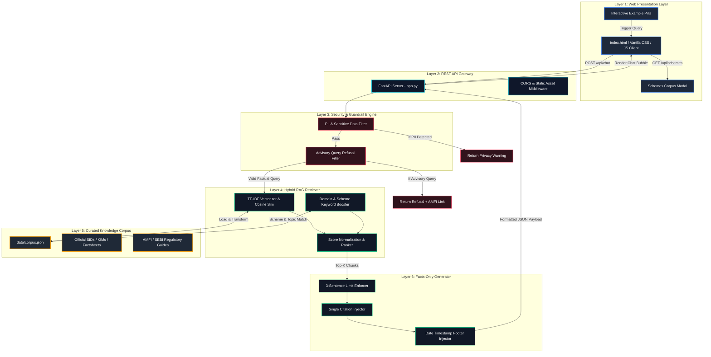
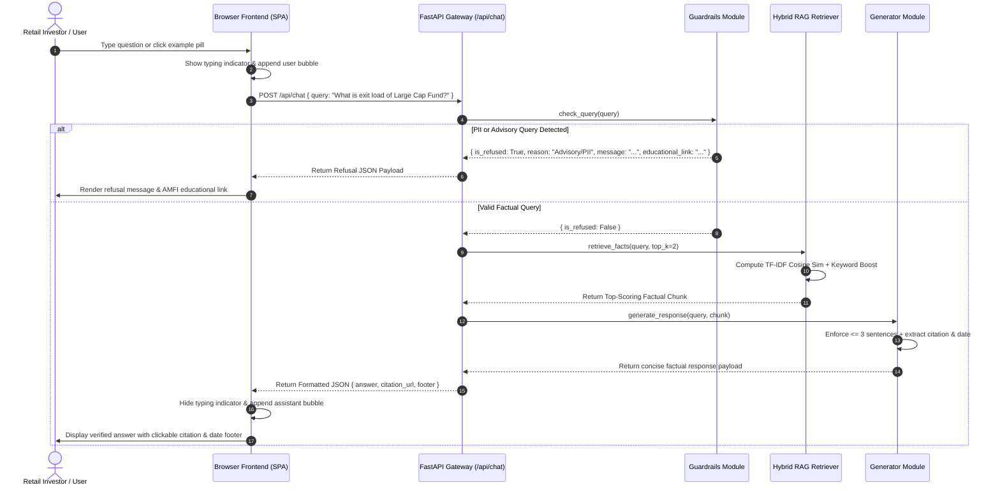

# System Architecture & Technical Design Document

**Project Name:** FundIQ • Facts-Only Mutual Fund FAQ Assistant  
**Reference Product Context:** Groww  
**Selected Asset Management Company (AMC):** ICICI Prudential Mutual Fund  
**Core Architectural Paradigm:** Lightweight Hybrid Retrieval-Augmented Generation (RAG) with Strict Guardrails  

---

## 1. System Overview & Design Philosophy

FundIQ is an enterprise-grade, facts-only FAQ assistant designed to answer objective, verifiable mutual fund queries while strictly eliminating generative hallucinations, advisory bias, and speculative predictions.

In financial domain AI, **accuracy and compliance take precedence over conversational intelligence**. While traditional Large Language Models (LLMs) are optimized for fluency and creativity, they are prone to fabricating numbers or accidentally offering regulated investment advice. FundIQ solves this by implementing a **deterministic, lightweight Hybrid RAG architecture** over a closed, curated corpus of official public documents (AMC Scheme Information Documents, Key Information Memorandums, monthly factsheets, AMFI, and SEBI regulations).

### Key Architectural Principles
1. **Zero Hallucination by Design**: Responses are synthesized strictly from verified factual chunks extracted from official documents. No generative guessing occurs.
2. **Strict Regulatory Compliance**: Built-in guardrails intercept advisory questions (*"Should I invest?"*, *"Which fund is better?"*) and refuse them with educational citations.
3. **Data Privacy & Security (Zero PII Storage)**: Automatic interception of sensitive personal identifiers (PAN, Aadhaar, OTPs, Bank Account numbers) before query processing.
4. **Lightweight & Self-Contained**: Operates locally and reliably using statistical vectorization (TF-IDF + Cosine Similarity) and domain keyword boosting without requiring mandatory cloud vector databases or paid LLM API keys.
5. **UI Visual Excellence**: A premium, responsive Single-Page Application (SPA) utilizing dark mode aesthetics, glassmorphism, and micro-animations to deliver a modern user experience.

---

## 2. End-to-End System Architecture Diagram

The diagram below illustrates the multi-layered flow of a user request through the FundIQ RAG architecture:



---

## 3. Detailed Component Breakdown

### 3.1 Layer 1: Security & Guardrail Engine (`src/backend/guardrails.py`)
Before any query is sent to the retrieval engine, it passes through a two-stage guardrail filter:

1. **PII & Data Privacy Interceptor**:
   - Evaluates incoming query strings against high-precision regex patterns for Indian financial privacy identifiers:
     - **PAN Card**: `\b[A-Z]{5}[0-9]{4}[A-Z]{1}\b`
     - **Aadhaar Number**: `\b\d{4}\s*\d{4}\s*\d{4}\b`
     - **Phone Numbers**: `\b(?:\+91|0)?\s*^[6-9]\d{9}$\b`
     - **OTPs & PINs**: `\b\d{4,6}\s*(?:is\s+my|otp|pin|password)\b`
     - **Bank Accounts**: `\b(?:account|acct|a/c)\s*(?:no|number)?\s*[:=]?\s*\d{9,18}\b`
   - *Action*: If PII is detected, the pipeline immediately halts and returns a security warning advising the user never to input sensitive financial credentials.

2. **Advisory & Speculative Query Refusal Engine**:
   - Financial assistants must adhere to SEBI non-advisory guidelines. Queries asking for subjective opinions, return projections, or investment advice are intercepted using regex patterns and heuristic phrase matching:
     - Examples: *"Should I invest in...?"*, *"Which fund is better?"*, *"Will this fund give 20% return?"*, *"Recommend a safe fund"*, *"predict future growth"*.
   - *Action*: Refuses the query politely, reinforces the facts-only boundary, and provides an official educational citation pointing to the AMFI Investor Education center (`https://www.amfiindia.com`).

---

### 3.2 Layer 2: Curated Knowledge Corpus (`data/corpus.json`)
To eliminate reliance on third-party aggregators or unverified blogs, FundIQ operates over an immutable, curated JSON schema containing verified facts from official sources:

```json
{
  "amc": "ICICI Prudential Mutual Fund",
  "reference_context": "Groww",
  "last_updated_date": "July 2026",
  "schemes": [
    {
      "name": "ICICI Prudential Large Cap Fund (Direct - Growth)",
      "category": "Large Cap Fund",
      "groww_url": "https://groww.in/mutual-funds/icici-prudential-large-cap-fund-direct-growth",
      "official_sid_kim_url": "https://www.icicipruamc.com/downloads/sid-kim",
      "official_factsheet_url": "https://www.icicipruamc.com/downloads/factsheets"
    }
  ],
  "chunks": [
    {
      "id": "chunk_1",
      "scheme": "ICICI Prudential Large Cap Fund",
      "topic": "Expense Ratio",
      "keywords": ["expense ratio", "large cap fund", "cost", "fee", "ter"],
      "content": "The Total Expense Ratio (TER) of ICICI Prudential Large Cap Fund is approx 0.88% per annum...",
      "source_url": "https://www.icicipruamc.com/downloads/sid-kim",
      "last_updated": "July 2026"
    }
  ]
}
```

#### Scheme Scope & Diversity
The corpus encapsulates 5 category-diverse ICICI Prudential schemes mapped from Groww URLs:
1. **Large Cap Fund** (*ICICI Prudential Large Cap Fund*)
2. **Dynamic Asset Allocation / Balanced Advantage Fund** (*ICICI Prudential Dynamic Plan*)
3. **Short Duration Debt Fund** (*ICICI Prudential Short Term Fund*)
4. **Flexi Cap Fund** (*ICICI Prudential Flexicap Fund*)
5. **Top 100 Large Cap Fund** (*ICICI Prudential Top 100 Fund*)

---

### 3.3 Layer 3: Hybrid RAG Retriever (`src/backend/retriever.py` & `chunker_and_embedder.py`)
Standard dense embedding models often fail on exact alphanumeric keyword matching (such as differentiating between *"Flexicap Fund"* and *"Large Cap Fund"* or exact expense ratio terms). FundIQ implements a **Hybrid Retrieval Score** combining open-source BGE neural embeddings with statistical domain heuristics:

$$\text{Total Score}(q, c) = \alpha \cdot \text{BGE/TF-IDF CosineSim}(q, c) + \beta \cdot \text{KeywordBoost}(q, c)$$

1. **Exclusively BGE Open-Source Embeddings (`BAAI/bge-small-en-v1.5`)**:
   - For semantic vector representation, the ingestion engine uses **strictly the BGE model (`BAAI/bge-small-en-v1.5`)** via `sentence-transformers`, running 100% locally at zero cost.
   - Computes Cosine Similarity between normalized query embeddings and pre-indexed chunk vectors (`scheme + topic + keywords + content`).
   - *Weight*: Scaled by a factor of $\alpha = 5.0$ to provide smooth semantic grading across documents, with a zero-dependency TF-IDF fallback if offline.

2. **Domain Keyword & Scheme Boosting**:
   - Evaluates exact scheme mentions (e.g., boosting large-cap chunks by $+3.0$ when `"large cap"` appears in the query).
   - Evaluates topic keywords (e.g., $+3.0$ boost for `"statement"` or `"cas"` when matching statement download chunks; $+3.0$ for `"elss"` or `"lock in"`).
   - Word intersection rewards exact overlap between query tokens and chunk tags.

3. **Ranker & Top-K Selection**:
   - Sorts chunks in descending order of total score and selects the top valid chunk ($k=1$ or $k=2$) for response synthesis.

---

### 3.4 Layer 4: Facts-Only Generator (`src/backend/generator.py`)
Once the top verified chunk is retrieved, the generator formats the response according to strict project constraints:

1. **Ultra-Fast Open-Source LLM Synthesis via Groq**:
   - Uses the official `groq` Python SDK with `llama-3.3-70b-versatile` to synthesize a fluid, authoritative, facts-only summary from the retrieved chunk content.
   - Includes automatic fault-tolerance: if the Groq API call fails or the server is offline, it seamlessly reverts to extractive regex summarization.

2. **Intelligent Sentence Segmenter (3-Sentence Limit)**:
   - Financial texts contain frequent periods inside abbreviations (`Rs.`, `approx.`, `vs.`, `e.g.`, `i.e.`). Standard `split('.')` algorithms break on these abbreviations.
   - FundIQ uses a negative-lookbehind regular expression:
     ```python
     re.split(r'(?<!\bRs)(?<!\bapprox)(?<!\be\.g)(?<!\bi\.e)(?<!\bvs)\.\s+|\?\s+|\!\s+', text)
     ```
   - Retains a **maximum of 3 sentences**, appending proper punctuation.

3. **Single Citation Link Injection**:
   - Extracts the exact `source_url` from the retrieved chunk metadata and binds it as a mandatory single citation attribute.

4. **Timestamp Footer Injection**:
   - Appends the mandatory regulatory footer string:
     `Last updated from sources: <date>`

---

### 3.5 Layer 5: REST API Gateway (`src/backend/app.py`)
Built on **FastAPI** and **Uvicorn**, providing asynchronous REST communication and static asset delivery:
- `POST /api/chat`: Takes JSON `{ "query": "..." }`, runs guardrails, performs retrieval, and returns formatted response payloads.
- `GET /api/schemes`: Returns the list of the 5 selected schemes, categories, Groww reference links, and official AMC/AMFI citation URLs for UI modal rendering.
- `GET /api/examples`: Returns structured example queries and refusal demonstration queries.
- **CORS & Static Mounting**: Fully enabled CORS middleware for local frontend interaction and static serving of `/`, `/styles.css`, and `/app.js`.

---

### 3.6 Layer 6: Premium Frontend UI (`src/frontend/`)
The web presentation layer is built as a highly responsive Single-Page Application:
- **Structure (`index.html`)**: Features a top glassmorphic regulatory disclaimer banner, clear header branding with AMC/Groww badges, an interactive scheme explorer modal, example question pills, and a scrollable chat history container.
- **Aesthetics (`styles.css`)**: Vanilla CSS implementing deep navy/indigo dark mode (`#0a0e1a`), ambient floating background gradients (`radial-gradient`), glassmorphic card styling (`backdrop-filter: blur(16px)`), and smooth typing dot animations.
- **Logic (`app.js`)**: Asynchronous fetch API integration, DOM sanitization (`escapeHtml`) to prevent XSS attacks, dynamic typing indicators, auto-scrolling, and interactive modal drawer control.

---

## 4. Request / Response Lifecycle Sequence



---

## 5. Security, Privacy & Regulatory Compliance

| Compliance Requirement | Technical Implementation in FundIQ |
| :--- | :--- |
| **No Investment Advice** | Speculative keywords (*should I buy*, *which is better*, *predict*) trigger immediate refusal via regex guardrails. |
| **Official Sources Only** | All data chunks in `data/corpus.json` are hardcoded to official AMC SIDs, KIMs, Factsheets, AMFI, and SEBI portals. Zero third-party blogs or aggregators are indexed. |
| **Zero PII Processing** | Regex patterns intercept 10-character PAN cards, 12-digit Aadhaar numbers, phone numbers, email addresses, and OTPs before query processing. No user data is logged or persisted to disk. |
| **Verifiable Citations** | Every valid response payload strictly binds a single `citation_url` and date footer (`Last updated from sources: <date>`). |
| **Conciseness Limit** | Custom regex sentence segmentation guarantees no response exceeds 3 sentences, preventing verbose generative speculation. |

---

## 6. Scalability & Future Architecture Evolution

While FundIQ is currently built as a lightweight, self-contained assistant over a curated 5-scheme corpus, the architecture is designed for modular scalability:

1. **Scaling to 1,000+ Schemes with 100% Free Tools (Vector Database Integration)**:
   - If the corpus expands beyond 10,000 document chunks, `retriever.py` and `chunker_and_embedder.py` can be seamlessly scaled using **exclusively 100% free, open-source models and vector stores**:
     - **Free Embedding Models**: Exclusively use the open-source BGE model (`BAAI/bge-small-en-v1.5` or `BAAI/bge-large-en-v1.5`), which runs entirely locally at zero cost via `sentence-transformers` without requiring proprietary API keys.
     - **Free Vector Databases**: Index embeddings inside open-source vector engines such as **FAISS** (Facebook AI Similarity Search), **ChromaDB**, or **Qdrant** running locally or dockerized.
2. **Local Open-Source LLM Generation with Structured Output Parsing**:
   - For complex multi-document summarization without paid APIs, a local open-source LLM (such as **Llama 3 8B**, **Mistral 7B**, or **Phi-3** running via Ollama / Llama.cpp) can be plugged into `generator.py` using **Pydantic Structured Outputs**, enforcing strict schema compliance at zero cost:
     ```python
     class LLMResponseSchema(BaseModel):
         answer: str = Field(..., description="Max 3 sentences factual summary")
         citation_url: str = Field(..., description="Exact official URL from retrieved doc")
         last_updated: str = Field(..., description="Timestamp from document")
     ```
3. **Automated Corpus Ingestion Pipeline**:
   - A background cron job can be implemented using `pypdf` and `BeautifulSoup` to automatically scrape newly published AMC monthly factsheets on the 5th of every month, extracting updated Expense Ratios and Asset Allocations into `data/corpus.json`.
