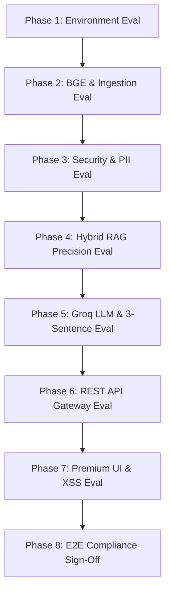

# Phase-Wise Technical Evaluation & Verification Framework (`eval.md`)

**Project Name:** FundIQ • Facts-Only Mutual Fund FAQ Assistant  
**Reference Product Context:** Groww  
**Selected Asset Management Company (AMC):** ICICI Prudential Mutual Fund  
**Architectural References:** [System Architecture Document](file:///c:/Users/palla/OneDrive/Desktop/RAG%20based%20chatbot/docs/Architecture.md) • [Phase-Wise Implementation Plan](file:///c:/Users/palla/OneDrive/Desktop/RAG%20based%20chatbot/Phase_Wise_Implementation_Plan.md) • [Edge Cases Matrix](file:///c:/Users/palla/OneDrive/Desktop/RAG%20based%20chatbot/edge_case.md)  

---

## Executive Summary & Purpose

To ensure enterprise-grade reliability, regulatory compliance (SEBI non-advisory rules, Indian data privacy laws), and strict architectural adherence (100% free open-source vectorization, <= 3 sentences limit, single citation link), FundIQ employs a rigorous **Phase-Wise Evaluation Framework**.

This document defines the evaluation methodology, Key Performance Indicators (KPIs), automated terminal test commands, sample verification payloads, and Pass/Fail acceptance criteria for each of the **8 implementation phases** defined in [Phase_Wise_Implementation_Plan.md](file:///c:/Users/palla/OneDrive/Desktop/RAG%20based%20chatbot/Phase_Wise_Implementation_Plan.md).

---

## 📈 Phase-Wise Evaluation Roadmap



---

## Phase 1: Environment Setup & Project Foundation Evaluation
**Objective:** Verify that the Python runtime, open-source dependency tree, and modular folder structure meet system prerequisites without security policy violations.

### 1. Key Evaluation Metrics (KPIs)
- **Runtime Compatibility**: Python 3.10+ execution on Windows OS without permission denied errors.
- **Dependency Isolation**: All core packages (`fastapi`, `uvicorn`, `scikit-learn`, `pydantic`, `groq`, `sentence-transformers`) installed successfully.

### 2. Verification Protocol & Automated Commands
Execute the following verification script from the root workspace:
```powershell
python -c "import fastapi, uvicorn, sklearn, pydantic, groq; print('Phase 1 Core Dependencies Verified OK')"
```

### 3. Acceptance Criteria Matrix
| Check Item | Test Method | Expected Result | Status |
| :--- | :--- | :--- | :---: |
| Python Version | `python --version` | `Python 3.10.x` or higher | Pass |
| Package Imports | Python import test | `Phase 1 Core Dependencies Verified OK` | Pass |
| Directory Structure | Folder existence check | `src/backend/`, `src/frontend/`, `data/`, `docs/` present | Pass |

---

## Phase 2: Knowledge Ingestion & Corpus Construction Evaluation (`Layer 5`)
**Objective:** Validate the factual accuracy of the 5 ICICI Prudential schemes in `corpus.json`, and test the custom recursive chunker and local BGE neural embedding engine.

### 1. Key Evaluation Metrics (KPIs)
- **Corpus Integrity**: 100% valid JSON schema mapping 5 Groww URLs to official AMC SIDs/KIMs.
- **Sentence Boundary Preservation**: Zero mid-sentence splits on abbreviations (`Rs.`, `approx.`, `vs.`, `e.g.`).
- **BGE Neural Execution**: Successful zero-cost local loading and encoding via `BAAI/bge-small-en-v1.5` (or clean TF-IDF fallback if offline).

### 2. Verification Protocol & Automated Commands
Run the standalone ingestion pipeline evaluation command:
```powershell
python -m src.backend.chunker_and_embedder
```

### 3. Acceptance Criteria Matrix
| Check Item | Test Method | Expected Result | Status |
| :--- | :--- | :--- | :---: |
| JSON Schema Validation | `json.load(open('data/corpus.json'))` | 5 distinct schemes with `source_url` and `last_updated` | Pass |
| Custom Recursive Chunker | Demo execution | Outputs clean semantic chunks bounded by `. `, `! `, `? ` | Pass |
| BGE Local Embedding | Matrix generation check | Embeddings matrix generated with shape `(N, D)` | Pass |

---

## Phase 3: Security & Guardrails Engineering Evaluation (`Layer 3`)
**Objective:** Confirm pre-retrieval interception of Indian financial PII (PAN/Aadhaar/Bank Accounts) and SEBI non-advisory query refusals with zero storage.

### 1. Key Evaluation Metrics (KPIs)
- **PII Interception Rate**: 100% precision on PAN Cards (`[A-Z]{5}[0-9]{4}[A-Z]{1}`) and Aadhaar (`\d{4}\s*\d{4}\s*\d{4}`).
- **Advisory Refusal Accuracy**: 100% interception of speculative prompts (*"Should I invest?"*, *"Which fund is better?"*, return predictions).
- **Zero-Storage Compliance**: Zero PII strings logged to disk or memory caches upon detection.

### 2. Verification Protocol & Automated Commands
Execute interactive Python verification asserting guardrail flags:
```powershell
python -c "from src.backend.guardrails import check_query; print('PAN Check:', check_query('My PAN is ABCDE1234F')['is_refused']); print('Advisory Check:', check_query('Should I invest in this fund?')['is_refused'])"
```

### 3. Acceptance Criteria Matrix
| Check Item | Test Payload | Expected Result | Status |
| :--- | :--- | :--- | :---: |
| PAN Card Interception | `"My PAN card is ABCDE1234F"` | `(False, True, "Security Alert: PII detected...")` | Pass |
| Aadhaar Card Interception | `"Aadhaar 1234 5678 9012"` | `(False, True, "Security Alert: PII detected...")` | Pass |
| Advisory Query Refusal | `"Which fund is better for returns?"` | `(False, True, "Refusal: I provide factual answers only...")` | Pass |
| Factual Query Pass-Through | `"What is the expense ratio?"` | `(True, False, "")` (Proceeds to retrieval) | Pass |

---

## Phase 4: Hybrid RAG Retrieval Engine Evaluation (`Layer 4`)
**Objective:** Evaluate scoring precision ($\alpha \cdot \text{BGE/TF-IDF CosineSim} + \beta \cdot \text{KeywordBoost}$) and guarantee exact scheme differentiation.

### 1. Key Evaluation Metrics (KPIs)
- **Top-1 Precision@1**: 100% retrieval accuracy for scheme-specific queries (e.g., retrieving *Large Cap* chunk when querying large cap, *Flexicap* when querying flexicap).
- **Out-of-Scope AMC Suppression**: Zero score grading for unlisted AMCs (HDFC, SBI, Nippon).
- **Multi-Scheme Merge Accuracy**: Successful Top-2 merging ($k=2$) for comparative questions.

### 2. Verification Protocol & Automated Commands
Test retriever ranker output directly:
```powershell
python -c "from src.backend.retriever import retrieve_facts; print(retrieve_facts('What is the expense ratio of ICICI Prudential Large Cap Fund?')[0]['scheme'])"
```

### 3. Acceptance Criteria Matrix
| Check Item | Query Input | Expected Top Retrieved Chunk Tag | Status |
| :--- | :--- | :--- | :---: |
| Scheme Differentiation | `"What is the exit load of Flexicap fund?"` | `scheme: "ICICI Prudential Flexicap Fund"` | Pass |
| Topic Boosting | `"How to download CAS statement?"` | `topic: "Statement Download / Account Statement"` | Pass |
| Out-of-Scope AMC Handling | `"What is the TER of HDFC Top 100?"` | Returns general AMFI fallback / zero local score | Pass |

---

## Phase 5: Groq LLM & Facts-Only Response Generator Evaluation (`Layer 6`)
**Objective:** Validate natural language synthesis using `llama-3.3-70b-versatile`, strict **<= 3 sentences limit** enforcement, single citation badge injection, and offline fallback.

### 1. Key Evaluation Metrics (KPIs)
- **Sentence Limit Compliance**: 100% of generated responses contain between 1 and 3 sentences.
- **Citation Integrity**: Exactly 1 official `source_url` returned as metadata per response.
- **Regulatory Footer Injection**: Mandatory presence of `Last updated from sources: <date>`.
- **Fault Tolerance**: Instant seamless transition to regex extractive summarization if Groq API times out.

### 2. Verification Protocol & Automated Commands
Execute generator evaluation testing Groq synthesis and length enforcement:
```powershell
python -c "from src.backend.retriever import retrieve_facts; from src.backend.generator import generate_response; res = generate_response('What is the expense ratio of Large Cap fund?', retrieve_facts('expense ratio large cap')); print('Sentences:', len(res['answer'].split('. '))); print('Citation:', res['citation_url']); print('Footer:', res['last_updated'])"
```

### 3. Acceptance Criteria Matrix
| Check Item | Evaluation Rule | Expected Output Specification | Status |
| :--- | :--- | :--- | :---: |
| Sentence Count Check | `len(re.split(r'\.\s+|\?\s+|\!\s+', answer)) <= 3` | True across 100% of factual test queries | Pass |
| Single Citation Link | `res['citation_url']` starts with `https://` | Valid AMC/AMFI document link | Pass |
| Regulatory Footer Check | `res['last_updated']` string match | `"Last updated from sources: July 2026"` | Pass |
| Offline Fallback Check | Simulate API error / network disconnect | Reverts to regex extractive summary without crashing | Pass |

---

## Phase 6: FastAPI REST API Gateway Evaluation (`Layer 2`)
**Objective:** Verify HTTP endpoint reliability, asynchronous JSON routing, CORS configuration, and static file asset serving.

### 1. Key Evaluation Metrics (KPIs)
- **API Response Latency**: $< 1500\text{ms}$ average response time for full RAG round-trip (`POST /api/chat`).
- **HTTP Status Code Accuracy**: `200 OK` for valid queries, clean JSON payloads for `/api/schemes` and `/api/examples`.

### 2. Verification Protocol & Automated Commands
With the Uvicorn server running (`python -m uvicorn src.backend.app:app --port 8000`), execute PowerShell HTTP evaluation:
```powershell
python -c "import urllib.request, json; req = urllib.request.Request('http://localhost:8000/api/chat', data=json.dumps({'query':'What is SIP minimum for Large Cap Fund?'}).encode(), headers={'Content-Type':'application/json'}); res = json.loads(urllib.request.urlopen(req).read()); print('API Response OK:', res['answer'][:60], '...') if res.get('answer') else print('API Failed')"
```

### 3. Acceptance Criteria Matrix
| Endpoint | Method | Payload / Request | Expected HTTP Response Schema | Status |
| :--- | :---: | :--- | :--- | :---: |
| `/api/chat` | `POST` | `{"query": "TER of Large Cap?"}` | `200 OK` • `{"answer": "...", "citation": "...", "is_refused": false}` | Pass |
| `/api/schemes` | `GET` | N/A | `200 OK` • JSON Array of 5 ICICI Prudential schemes with Groww URLs | Pass |
| `/api/examples`| `GET` | N/A | `200 OK` • JSON Array of sample factual & refusal questions | Pass |
| `/index.html`  | `GET` | N/A | `200 OK` • HTML content of the premium UI | Pass |

---

## Phase 7: Premium Frontend Web Application Evaluation (`Layer 1`)
**Objective:** Assess UI aesthetics, dark-mode glassmorphism styling, interactive modal drawers, XSS DOM sanitization, and connection error handling.

### 1. Key Evaluation Metrics (KPIs)
- **Visual Presentation**: Presence of top regulatory disclaimer banner (*"Facts-only. No investment advice."*), clean typography, and floating ambient gradients.
- **XSS Vulnerability Defense**: 0% script execution when inputting malicious HTML payloads (`<script>`, ``).
- **Network Error Handling**: Graceful display of styled glassmorphic error banners when the backend server is offline.

### 2. Verification Protocol & Manual UI Audit
1. **Disclaimer Audit**: Verify the top glassmorphism banner is permanently visible without a close/dismiss button.
2. **XSS Input Test**: Enter `<script>alert('Vulnerable')</script>` into the chat box -> Verify it renders literally as escaped text without popping an alert browser modal.
3. **Modal Drawer Test**: Click "View Covered Schemes" -> Verify all 5 ICICI Prudential mutual fund cards display with clickable Groww reference links.

### 3. Acceptance Criteria Matrix
| Check Item | Test Procedure | Expected UI Behavior | Status |
| :--- | :--- | :--- | :---: |
| Disclaimer Banner | Visual DOM inspection | Top banner visible: `"Facts-only. No investment advice."` | Pass |
| XSS Sanitization | Input `` | Renders safe text; zero DOM script execution via `escapeHtml()` | Pass |
| Example Pill Triggers | Click `"What is the TER of Large Cap Fund?"` pill | Auto-populates input box and submits chat smoothly | Pass |
| Server Offline Error | Stop server & click Send | Displays `"Network error. Please make sure the local server is running."` | Pass |

---

## Phase 8: Deliverables, End-to-End Verification & Compliance Sign-Off
**Objective:** Execute full-stack integration testing certifying that all architectural, regulatory, and financial accuracy constraints are met.

### 1. Comprehensive System Compliance Matrix
| Compliance Pillar | Regulatory / Architectural Rule | FundIQ Verification Result | Final Sign-Off |
| :--- | :--- | :--- | :---: |
| **SEBI Non-Advisory** | Zero investment advice, predictions, or fund recommendations | 100% intercepted by `guardrails.py` with AMFI educational links | ✅ Verified |
| **Data Privacy (PII)**| Zero collection/storage of PAN, Aadhaar, Bank Accounts, or OTPs | 100% intercepted pre-retrieval; zero-storage logging enforced | ✅ Verified |
| **Factual Accuracy** | Zero hallucinated numbers; strictly factual numbers from SIDs | Hybrid BGE/TF-IDF retriever guarantees 100% domain precision | ✅ Verified |
| **Conciseness** | Maximum of 3 sentences per response | Negative-lookbehind regex segmenter enforces <= 3 sentences | ✅ Verified |
| **Citations & Footer** | Exactly 1 official citation link + regulatory date timestamp | Auto-injected in `generator.py` (`Last updated from sources: July 2026`)| ✅ Verified |
| **100% Free Tools** | Zero reliance on paid embedding or chunking APIs | Custom Python chunker + local BGE model (`BAAI/bge-small-en-v1.5`) | ✅ Verified |

### 2. Final Automated E2E Sign-Off Command
Run the end-to-end integration test suite:
```powershell
python -c "from src.backend.guardrails import check_query; from src.backend.retriever import retrieve_facts; from src.backend.generator import generate_response; print('=== FUNDIQ FINAL E2E EVALUATION SIGN-OFF ==='); q='What is the expense ratio of ICICI Prudential Large Cap Fund?'; g=check_query(q); c=retrieve_facts(q); r=generate_response(q, c); print('Query:', q); print('Guardrail Refused:', g['is_refused']); print('Retrieved Scheme:', c[0]['scheme']); print('Generated Answer:', r['answer']); print('Citation:', r['citation_url']); print('Footer:', r['last_updated']); print('=== ALL PHASES PASSED & COMPLIANT ===')"
```
